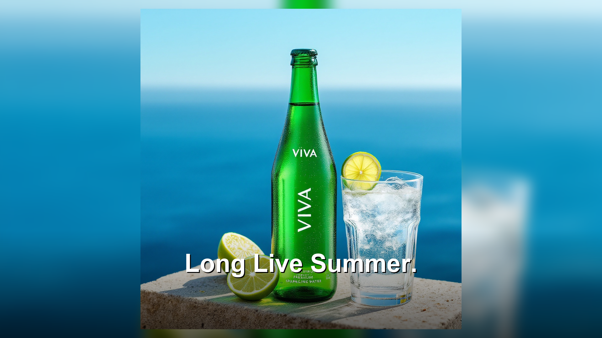

# Creative Automation Pipeline

A locally-runnable AI pipeline that accepts a campaign brief, generates branded product hero images via GenAI, and renders them at three social aspect ratios with text overlay, brand compliance checking, and a polished HTML report. Runs as a CLI tool, a FastAPI web server with a full single-page UI, or a Streamlit app.

---

## What This Does

Marketing teams spend hours manually adapting a single creative across Instagram, Stories, and YouTube formats. This pipeline eliminates that loop. Give it a campaign brief — in plain English or JSON — and it produces six production-ready creatives (two products, three formats each), a brand compliance report, and an estimated API cost, in under a minute.

It maps directly to five enterprise pain points: accelerating campaign production, maintaining brand consistency across surfaces, reducing creative iteration cost, supporting multi-market localization, and providing transparent cost tracking for each run.

---

## Storage

Generated hero images are cached in `assets/generated/` using the product ID as the filename key. Final creatives are written to `outputs/{product_id}/{format}.png`. Both paths are resolved via `pathlib.Path` and created automatically on first run — no manual setup required.

**Azure Blob Storage is supported** via `azure_storage.py`. Set `AZURE_STORAGE_CONNECTION_STRING` and `AZURE_STORAGE_CONTAINER` in `.env` to enable two optional flags:

```bash
# Load brief directly from Azure Blob
python main.py --generate az://briefs/viva_summer.json

# Upload generated outputs to Azure Blob after run
python main.py --generate campaign_brief.json --upload-azure
```

Local filesystem is always the default. Azure activates only when the connection string is configured and the flag is passed. Blob paths mirror the local `outputs/` structure: `{campaign_id}/{product_id}/{format}.png`.

---

## Architecture

```
INPUT LAYER
--------------------------------------------------------------
  [Streamlit UI]                    [CLI]
  Natural language or JSON brief    --generate campaign_brief.json
         |                               |
         v                               v
 Brief Intake (brief_parser.py / brief_parser_nl.py)
   NL path: GPT-4o -> structured JSON
   JSON path: load + validate schema
         |
         v
 Legal Checker (legal_checker.py)
   Scan campaign message for prohibited words
   Fail fast before any API calls if flagged
         |
         v (per product)
 Asset Resolver (asset_resolver.py)
   Check explicit asset_path, then assets/{id}.png|jpg|webp
   Found  -> load, log "reused"
   Missing -> Image Generator
         |
         v
 Image Generator  (generators/)
   ImageGeneratorBase: generate(prompt) -> local path
   Flux 1.1 Pro    primary   -- BFL direct API, async submit/poll
   GPT Image 1     fallback  -- OpenAI SDK, synchronous
   Google Imagen   stub      -- extensibility demo
   Retry with exponential backoff (3 attempts: 2s, 4s, 8s)
         |
         v
 Format Renderer (format_renderer.py)
   1:1   1080x1080  Instagram Feed
   9:16  1080x1920  Stories / Reels
   16:9  1920x1080  Facebook / YouTube
   Default: fit_blur -- hero thumbnailed and centered on
            blurred cover-scaled background (no content loss)
   Text overlay: bottom-third, 80pt down to 40pt, drop shadow
   Optional: GPT-4o-mini translation for non-English markets
         |
         v
 Output Writer (output_writer.py)
   outputs/{product_id}/1x1.png
   outputs/{product_id}/9x16.png
   outputs/{product_id}/16x9.png
         |
         v
 Brand Checker (brand_checker.py)
   Logo presence via Pillow template matching (pixel similarity)
   Dominant color vs brand palette (Euclidean RGB distance)
         |
         v
 Logger + Report Generator
   campaign_run.log  -- structured, all events + cost summary
   outputs/report.html -- self-contained, base64 images inline
   Streamlit: images displayed inline as they are generated
--------------------------------------------------------------
OUTPUT: 6 creatives, 1 HTML report, 1 run log
```

---

## Quick Start

```bash
git clone <repo-url>
cd creative-pipeline

python -m venv .venv

# Windows
.venv\Scripts\activate

# macOS / Linux
source .venv/bin/activate

pip install -r requirements.txt

cp .env.example .env
# Edit .env and add your BFL_API_KEY and/or OPENAI_API_KEY
```

---

### Option A — CLI

```bash
# First-time key setup (interactive)
python main.py --setup

# Run against the example brief (Flux, default)
python main.py --generate campaign_brief.json

# Run one of the additional example briefs
python main.py --generate briefs/tech_brief.json
python main.py --generate briefs/lumina_brief.json
python main.py --generate briefs/maison_brief.json
python main.py --generate briefs/onyx_brief.json

# Switch provider to GPT Image 1
python main.py --generate campaign_brief.json --provider gpt-image-1

# Parse a natural language description into a JSON brief
python main.py --parse "Summer campaign for Viva beverages and energy bars targeting health-conscious adults"

# Upload outputs to Azure Blob after run
python main.py --generate campaign_brief.json --upload-azure

# Load brief directly from Azure Blob
python main.py --generate az://briefs/viva_summer.json
```

The pipeline can also be imported directly:

```python
from brief_parser import load_brief
from pipeline import run_pipeline

brief = load_brief("campaign_brief.json")
result = run_pipeline(brief)
```

---

### Option B — Web UI + API server

```bash
python server.py
```

Opens at `http://localhost:8080`. Full single-page app with:

- **Live SSE progress streaming** — stage-by-stage pipeline updates as images generate
- **Model selector** — switch between Flux 1.1 Pro and GPT Image 1 per run
- **Example chips** — one-click load for five pre-built campaign briefs (Viva, TechFlow, Lumina, Maison Arc, Onyx Coffee)
- **Natural language tab** — describe a campaign in plain English, parse to JSON via GPT-4o
- **Campaign history panel** — browse and reload previous runs
- **ZIP download** — export all creatives for a campaign in one click
- **API key drawer** — enter keys via the UI; saved to `.env` automatically

---

### Option C — Streamlit UI

```bash
streamlit run app.py
```

Opens at `http://localhost:8501`. Sidebar-based interface with API key configuration, JSON brief editor, natural language tab, and inline image preview as creatives are generated. Simpler than the web UI — useful for local exploration.

---

## Campaign Brief Schema

```json
{
  "campaign_id": "viva_summer",
  "region": "US",
  "language": "en",
  "target_audience": "health-conscious adults 25-40",
  "campaign_message": "Long Live Summer.",
  "brand": {
    "name": "Viva",
    "logo_path": "assets/viva_logo.png",
    "colors": ["#2ECC71", "#FFFFFF", "#1A1A2E"]
  },
  "products": [
    {
      "id": "viva_sparkling_water",
      "name": "Viva Sparkling Water",
      "description": "Premium sparkling water in a sleek glass bottle, fresh lime and mint, bright white background, clean lifestyle product photography",
      "asset_path": null
    },
    {
      "id": "viva_energy_bar",
      "name": "Viva Energy Bar",
      "description": "Natural energy bar with visible oats and dark chocolate chips on a rustic wooden surface, warm morning light, health and vitality",
      "asset_path": null
    }
  ]
}
```

| Field | Required | Notes |
|---|---|---|
| `campaign_id` | Yes | Identifier used for output folders and history |
| `region` | Yes | Market region (e.g., "US", "EU") |
| `language` | No | Defaults to "en"; triggers GPT-4o-mini translation if non-English |
| `target_audience` | Yes | Feeds into image generation prompt |
| `campaign_message` | Yes | Text overlaid on all creatives; scanned for prohibited words |
| `brand.name` | Yes | Used in image prompt |
| `brand.logo_path` | No | Path to logo PNG for compliance check |
| `brand.colors` | No | Hex strings; used for fit_fill mode and color compliance |
| `product.id` | Yes | Used for output folder naming and asset lookup |
| `product.description` | Yes | Primary image generation prompt input |
| `product.asset_path` | No | If set, skips generation and reuses this image |

The natural language tab in the Streamlit UI converts plain-English descriptions into this schema via GPT-4o structured output.

---

## Example Output

Running against `campaign_brief.json` (Viva brand, two products):

```
outputs/
  viva_sparkling_water/
    1x1.png    -- 1080x1080  Instagram Feed
    9x16.png   -- 1080x1920  Stories / Reels
    16x9.png   -- 1920x1080  Facebook / YouTube
  viva_energy_bar/
    1x1.png
    9x16.png
    16x9.png
  report.html  -- self-contained HTML, opens in browser

campaign_run.log

============================================================
PIPELINE RUN SUMMARY
============================================================
Campaign    : viva_summer
Products    : 2
Generated   : 2 images (flux)
Reused      : 0 images
Errors      : 0
Duration    : 10.9s
Est. Cost   : $0.1000
============================================================
```

### Sample outputs (Viva brand, Flux 1.1 Pro)

**Viva Sparkling Water**

| Instagram Feed (1:1) | Stories / Reels (9:16) | Facebook / YouTube (16:9) |
|---|---|---|
|  |  |  |

**Viva Energy Bar**

| Instagram Feed (1:1) | Stories / Reels (9:16) | Facebook / YouTube (16:9) |
|---|---|---|
|  |  |  |

The 9:16 format uses `fit_blur` — the full product is centered on a cover-scaled, blurred version of itself. No content cropped, no hard letterbox bars.

---

## Design Decisions

### 1. Two image models, one interface

The pipeline ships with two live image providers — Flux 1.1 Pro and GPT Image 1 — switchable with a single env var or a UI dropdown. Both receive identical prompts, so clients can compare model output side by side without any code changes. Adding a third provider (Google Imagen, Firefly) means writing one class and one factory case. Vendor lock-in is an operational risk; the provider-agnostic interface is the hedge against it.

### 2. fit_blur as the default aspect ratio strategy

Source images are 1024x1024 (square). Center-cropping a square to 9:16 requires reducing width to 576px — losing 44% of the image on each side. For a product creative, that means the product is mostly out of frame. `fit_blur` preserves the complete product in every format by centering the hero image on a cover-scaled, blurred version of itself. No hard letterbox bars. No content loss. Instagram uses this natively.

### 3. One hero per product, three formats

Visual consistency across surfaces. The same creative adapted, not three separate AI interpretations of the same prompt. Separate generations would triple cost and produce inconsistency — the exact pain point the client described. Generate once, render many.

### 4. Legal check runs first

Fail fast before any API spend. A campaign brief containing "guaranteed" or "free" gets rejected before a single image is generated. In production this integrates with a legal review queue; here it's a configurable word list with word-boundary matching (flags "get it free", not "freedom").

### 5. Natural language brief parser

Real campaign managers describe campaigns in sentences, not JSON. GPT-4o structured output converts plain English into the validated brief schema in ~30 lines of code. `temperature=0.3` produces consistent structured output while allowing varied phrasing for the product description field, which feeds directly into image generation quality.

### 6. Self-contained HTML report

The report is the output layer for non-engineers. Images are base64-encoded inline — no server, no CDN, no external paths. Email it, share it, open it offline. A marketing director reviewing a campaign doesn't open a terminal; they open a browser tab.

### 7. Asset reuse before generation

Cache-first is the correct production pattern. If `asset_path` is set in the brief, or a file named `assets/{product_id}.png` exists, the pipeline skips generation entirely. A brand running hundreds of campaigns monthly wants deterministic output and cost discipline — regenerating the same product image adds cost without adding value.

### 8. Pillow for all image manipulation

Resize, blur, text overlay, color extraction, template matching — all local, all free, all instant. The only network calls in the pipeline are image generation (Flux or GPT Image 1) and optionally the NL brief parser (GPT-4o). Everything else runs offline.

### 9. pipeline.py as the shared core

Both interfaces — Streamlit and CLI — are thin wrappers around `run_pipeline()`. Progress is reported via a `progress_callback(stage, message)` function that each interface supplies. Streamlit updates an `st.empty()` block; CLI prints to the terminal. One pipeline function, two access surfaces, no duplicated logic.

---

## Assumptions and Limitations

- **Aspect ratio strategy**: `fit_blur` preserves content but is not content-aware. In production, Adobe Firefly Generative Fill would extend the background naturally based on the image content, rather than blurring the hero. This is the correct POC equivalent — the documented upgrade path is explicit.
- **Brand compliance**: Logo detection uses pixel-level template matching, not semantic understanding. It detects presence at scale, not correct usage, clear space, or orientation. Production would use a vision model (GPT-4o Vision, Gemini) for semantic compliance.
- **Legal check**: Keyword-based with word-boundary matching. Not semantic — "this product is free of artificial flavors" would flag "free". Production integrates with a legal review system.
- **Single-tenant**: No authentication, no multi-user isolation. Local filesystem storage. Production: S3/Azure Blob, DAM integration, per-user campaign namespacing.
- **Synchronous pipeline**: The per-product loop runs sequentially. At scale, product generation would be parallelized across async workers.

---

## What Production Looks Like

| POC | Production |
|---|---|
| Local filesystem (default) + Azure Blob via `--upload-azure` | S3 / Azure Blob / DAM system with CDN |
| Sequential pipeline.py | Async job queue (Celery, AWS Step Functions) |
| fit_blur background fill | Firefly Generative Fill (content-aware extension) |
| Pixel template matching | Vision model semantic compliance |
| Keyword legal check | Legal review queue integration |
| Local Streamlit | Campaign management platform with auth and approval workflow |
| Cost estimates in log | Provider billing API integration, per-campaign spend dashboards |
| Single provider per run | A/B generation across providers for quality comparison |

---

## Project Structure

```
creative-pipeline/
|-- app.py                    # Streamlit UI -- primary interface
|-- main.py                   # CLI entry point -- secondary interface
|-- config.py                 # All constants, paths, provider settings
|-- pipeline.py               # Core orchestration (shared by app + CLI)
|
|-- brief_parser.py           # JSON brief: load, validate, defaults
|-- brief_parser_nl.py        # Natural language -> JSON via GPT-4o
|-- legal_checker.py          # Prohibited word scan (word-boundary regex)
|-- asset_resolver.py         # Cache-first asset lookup
|
|-- generators/
|   |-- base.py               # Abstract base: generate(prompt) -> path
|   |-- __init__.py           # Provider factory + shared prompt builder
|   |-- flux_generator.py     # Flux 1.1 Pro (BFL direct API, async)
|   |-- openai_generator.py   # GPT Image 1 (OpenAI SDK, synchronous)
|   `-- google_generator.py   # Google Imagen stub (extensibility demo)
|
|-- format_renderer.py        # Pillow: fit_blur/fill/crop, text overlay
|-- output_writer.py          # Save organized outputs via pathlib.Path
|-- brand_checker.py          # Logo presence + color palette compliance
|-- logger.py                 # Structured run log + cost summary
|-- report_generator.py       # Self-contained HTML report
|-- campaign_store.py         # Campaign history persistence
|-- azure_storage.py          # Azure Blob: brief download + output upload
|
|-- assets/
|   |-- fonts/                # Bundled TTF font (falls back to system fonts)
|   `-- generated/            # Hero images saved here at runtime
|
|-- outputs/                  # Final creatives (gitignored by default)
|-- campaigns/                # Campaign history (brief + summary per run)
|-- docs/                     # Screenshots for README
|-- campaign_brief.json       # Example brief (Viva brand, two products)
|-- briefs/                   # Additional example briefs (TechFlow, Lumina, Maison Arc, Onyx)
|-- .env.example              # API key template
|-- requirements.txt
|-- LICENSE
`-- README.md
```

---

## Requirements

- Python 3.10+
- API keys for at least one image generation provider (Flux or GPT Image 1)
- OpenAI API key (required for NL brief parsing or GPT Image 1 generation; not needed if using Flux with a JSON brief)

```
openai>=1.0.0
pillow>=10.0.0
python-dotenv>=1.0.0
streamlit>=1.35.0
requests>=2.31.0
fastapi>=0.111.0
uvicorn>=0.29.0
azure-storage-blob>=12.0.0
```

---

## Environment Variables

Keys can be entered three ways — pick whichever is most convenient:

1. **Streamlit sidebar** — enter keys in the "Configure API Keys" expander; they are saved to `.env` automatically
2. **CLI setup** — `python main.py --setup` prompts for each key interactively
3. **Manual** — copy `.env.example` to `.env` and edit directly

```bash
# .env.example

# At least one image provider key is required
BFL_API_KEY=your_black_forest_labs_key_here
OPENAI_API_KEY=your_openai_key_here

# Active provider: flux | gpt-image-1
IMAGE_PROVIDER=flux

# Azure Blob Storage (optional -- enables --upload-azure and az:// brief loading)
AZURE_STORAGE_CONNECTION_STRING=
AZURE_STORAGE_CONTAINER=creative-pipeline
```

Keys are never logged, never committed (`.env` is gitignored), and never stored anywhere other than the local `.env` file.

---

## License

Apache 2.0. See [LICENSE](LICENSE).

&copy; 2026 Reflector Studios
